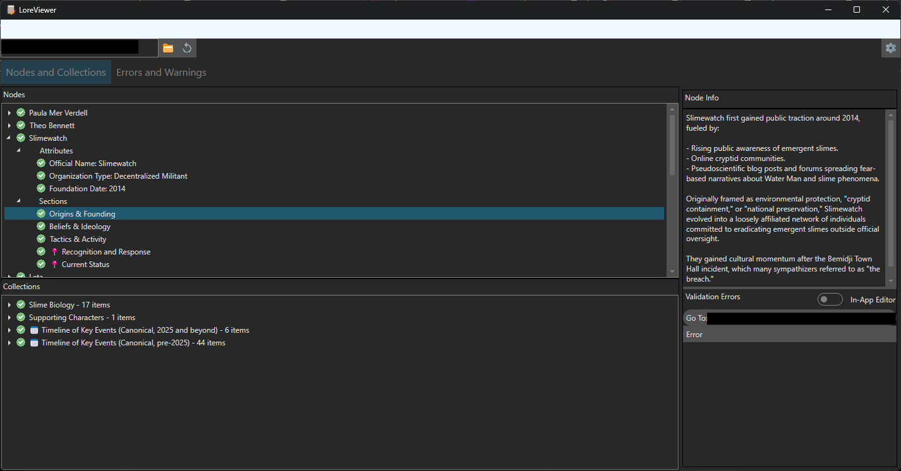
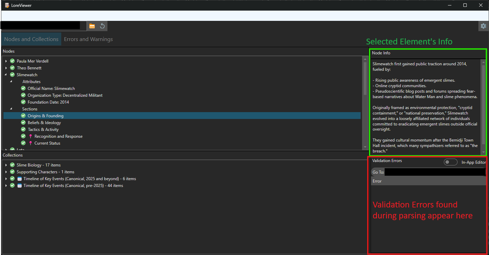
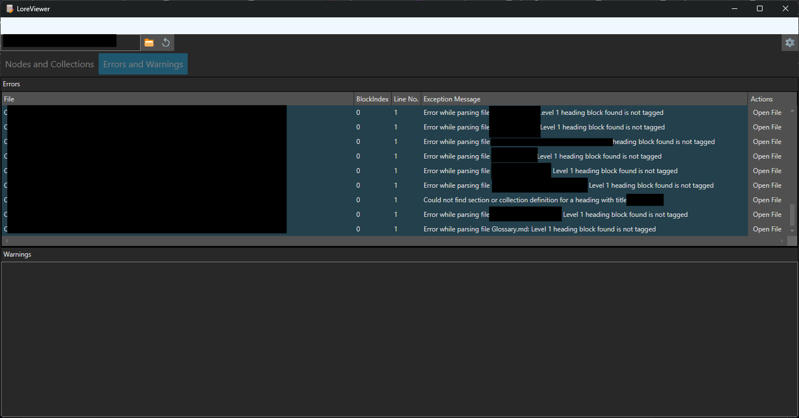
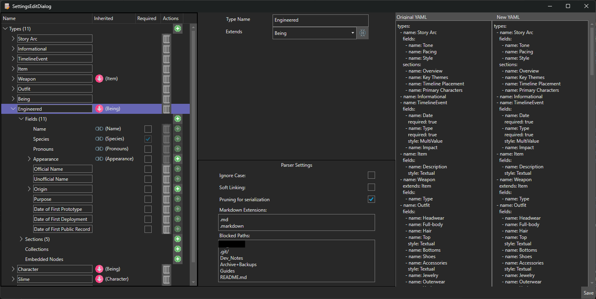

# LoreViewer: Markdown-Based World Building Tool

**LoreViewer** is a markdown-native, YAML-configurable lore parser and viewer designed to help worldbuilders, writers, and GMs structure, write, and reference their documents without sacrificing human readability of their files.

This tool will allow users to define their own schema for different types of lore elements (e.g., characters, timeline events, organizations), while keeping everything stored in plain markdown files with rich structure.

---

## Core Values of LoreViewer
1. Human-Readable Markdown First
    - Markdown files must remain human-readable. They should be intuitive to read and write without this software.
    - Heading structure and tags are designed to be out-of-the-way but (relatively) easily written by hand.
    - The schema (YAML) enforces structure but never obfuscates it.
2. Precision in Exception Handling
    - Errors are **contextual**: they include file name and line number, or block index.
    - Exceptions are meaningful: no vague stack traces.
    - Errors should **guide**, not confuse—especially since writers may not be developers.
3. Schema-Driven, But Somewhat Forgiving
	- Allow Sections and Collections of elements to exist in an element even when not defined for that type in schema.
4. Mergable, Divisible, Decentralized Content
    - Nodes can be written across multiple markdown files, but will still be viewed as **one element** in-app.
	- Allowing file separation is built on the understanding that human-driven file organization comes in many forms.

---

## As of v0.6:

LoreViewer is still very early in its development. Many of my desired features are not present, but the very basic core is there.

### Main Interface

#### Parsed lore

This interface is where the user's folder of lore files with settings is selected, and parsed lore is displayed



In the left side, under the 'Nodes and Collections' tab are lists of all the resulting elements and collections of elements defined in the markdown files.
At the top left, buttons for navigating to the lore folder and refreshing parsed contents are readily available.



A selected element will display its infomation on the top right side panel.
Any validation errors (files were able to be parsed fully, but some rules defined in schema were violated) will appear on the bottom right corner and give the user the opportunity to fix them, either using an in-app basic editor, or Notepad++ (if installed)

#### Errors and Warnings

The second tab, Errors and Warnings, shows any errors that prevented a markdown file from being parsed, and any warnings (which as of yet do not exist).



Errors will tell you which file had a parsing error, what the error was, where in the file the error occured, and provides a button to open the file to the relevant line (using Notepad++ if installed).

---

### Settings Editor (New for v0.6!)

LoreViewer now includes an in-app settings editor! Even though settings are in YAML and fairly easy to read and edit by hand, having an option to do so in the app is a vital piece of LoreViewer.



Here users can see all their defined Types and Collections, and add, remove, or alter any schema definitions. Types can be set to extend other types and inherit their fields, sections, etc. Fields can have their style changed (i.e. from a single value field to a field that contains subfields). And more.

On the right side is a quick comparison view to see what in the YAML schema has changed. When the save button in the bottom right is clicked, another diff view, showing colors for additions/deletions is shown as well, to give the user another chance to look over their new schema file before saving it.

---

## Core Rules for the Current Prototype

1. A defined type can only use one field layout style (e.g. bullet list — table support is planned but not yet implemented)
2. All fields must be defined in the YAML schema; undefined fields will trigger errors
3. Fields must appear before any sections or narrative content
4. Sections must be defined in the YAML and may contain freeform narrative
5. Sections are parsed recursively; nested sections are supported
6. Sections can contain structured fields, but they must be placed before narrative-only text.
7. A field can either have values or nested fields, not both.
8. A field with multiple values can only be flat if there is only one value in the markdown.

---

## Core Concepts

### Two Domains: Settings/Schema & Lore/Parsed Markdown

LoreViewer operates across two conceptual layers, the schema domain (what's defined in the YAML settings file) and the Lore domain (what's written in the markdown files).

For info on these layers, please see the [LoreViewer Wiki](https://github.com/YonuNautilus/LoreViewer/wiki)

### Quick Definitions: Nodes, Sections, Fields/Attributes, collections

- Node
  - represents a single object or concept (a religion, a character, spell, weapon, faction, cultural memes)
  - Used for such objects that need
    - organized information beyond just narrative or descriptive text
	- have descriptive Attributes
	- have nested objects, collections, or sections.
- Sections
  - represents a unit of descriptive information (a spell's side-effects, a recipe, a religious ritual, a dynamic between two characters)
  - Must be a child of a node or section
  - Can contain subsections and fields/attributes
  - CANNOT contain nested nodes or collections
- Fields/Attributes
  - Two names for the same thing. Organized, descriptive tidbits of information, usually common within a node type.
  - Must be in bullet point format, but can take various forms (covered later).
  - Fields can have a single value, or multiple values.
  - Fields have contain *either* nested fields *or* value(s)
- Collections
  - represents a collection of nodes usually of the same type.
  - can only contain nodes and collection name - no attributes, no sections

---

### What is a LoreNode?

A `LoreNode` is a structured, typed object — like a character, timeline event, or location.

It is declared in markdown using a top-level heading with a type tag:

```markdown
# Paula Mer Verdell {Character}
```

LoreNodes can also appear inside collections:

```markdown
# Supporting Characters {collection:Character}
## Paula Mer Verdell {Character}
```

---

## YAML Configuration

Every lore project must define a `Lore_Settings.yaml` file, which specifies:

* `types`: All valid types of LoreNodes and their structure
* `aliases`: Optional shorthand for type or collection tags

Example:

```yaml
types:
  Character:
    fields:
      - name: Species
        style: bullet_point
        required: true
      - name: Aliases
        style: MultiValue
      - name: Employment History
        nestedFields:
          - name: Organization
          - name: Roles
            multi: true
          - name: Duration
    sections:
      - name: Personality
        subsections:
          - name: Strengths
          - name: Weaknesses
      - name: History
        subsections:
          - name: Early Life
          - name: Later Years
      - name: Notes
```

---

## Field and Section Syntax

### Fields (Attributes)

Fields are defined at the top of a LoreNode or LoreSection in bullet-list format:

```markdown
# Paula Mer Verdell {Character}
- Species: Slime
- Aliases:
  - The Green Slime Secretary
  - Greenbean
- Employment History:
  - Organization: SIA
    - Roles:
      - Analyst
      - Envoy
    - Duration: 2022–2024

## Personality
- Tone: Timid

Paula is not very assertive, but is driven to do good and accurate work.
	
```

Table-style fields are not yet supported.

### Sections

Sections are introduced with subheadings inside a LoreNode (e.g. `## Personality`).

* Section title must be defined in the type's YAML under `sections:`
* Can contain nested subsections if listed under `sections:`
* Content inside sections is narrative: markdown blocks, bullet lists, quotes, etc.
* Sections CAN contain structured fields, but these must be defined in the section YAML. In the below example, the Personality section will need a Tone field defined.

Example:

```markdown
## Personality
- Tone: Confident

Vera is gentle and diligent.

### Strengths
- Resilient
- Empathic

### Weaknesses
- Hesitant
- Easily flustered
```

---

## Errors and Exceptions

A key part of LoreViewer's parsing is its ability to point out specifically what rule was violated during parsing, which file it occured in, and *where* specifically it occured.
Parsing exceptions will contain all of this information, allowing users to know *exactly* what caused a problem.

---

## Markdown Type Tagging

To give a markdown file or info within a file a 'type', that heading must be tagged.
Tagging is done with an HTML tag inline with the heading. There are currently 3 tags:

- `<node />`
  - denotes the heading as the start of a node (a new 'unit of lore')
- `<collection />` - denotes the heading as a collection: all subheadings are entries in the collection
- `<section />` - denotes the heading as a Section

### Tag Attributes

These HTML tags use attributes to clarify the type or meaning of the tag, and are required in most cases.

Currently, the only attribute is the string `type`.\
On `<node />` tags, `type` is used to associate the node with a defined type (as defined in schema).\
On `<collection />` tags, `type` is used to either associate the collection with a globally defined collection, locally defined collection, or if formatted correctly, a top-level free-floating collection.

***This section will be clarified later...***


---

## Parser Workflow

1. Deserializes the `Lore_Settings.yaml` file into a LoreSettings, containing definitions for types, sections, fields etc.
2. For each `.md` file:

   * Top-level heading determines node or collection type
   * Fields are parsed from first list block
   * Sections matched by heading level and name
   * Nested sections and subsections are parsed recursively
3. Unknown fields or sections → warning or error

---

## Future Features (Planned)

* Table field parsing
* Rich in-app editing
* Cross-file referencing and lookup
* Graphical relationship viewer
* Interactive dashboards for GMs and writers

---

To get started, prepare:

* A consistent folder of `.md` files
* A clean `Lore_Settings.yaml` defining all types and structure
